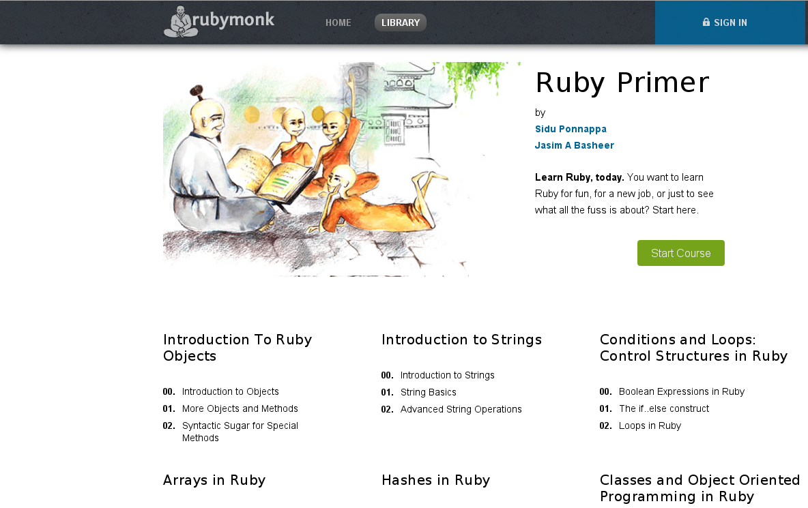
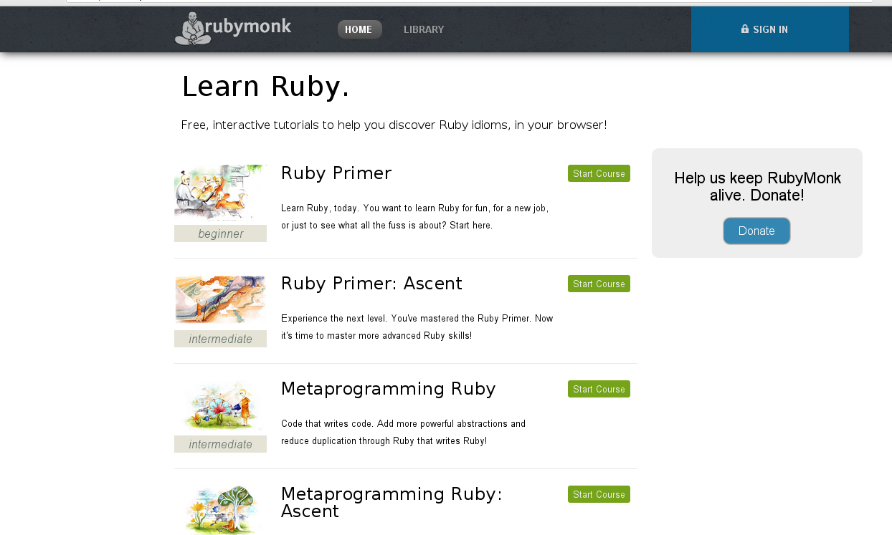
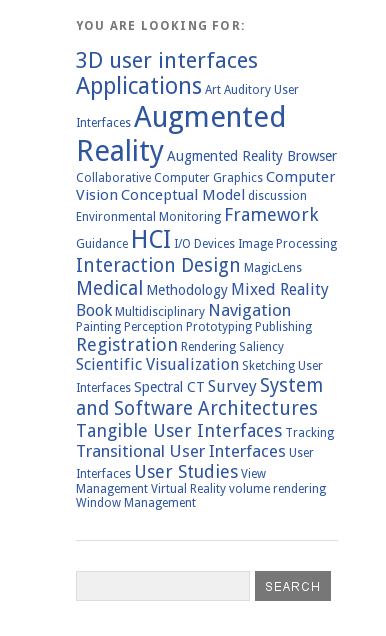
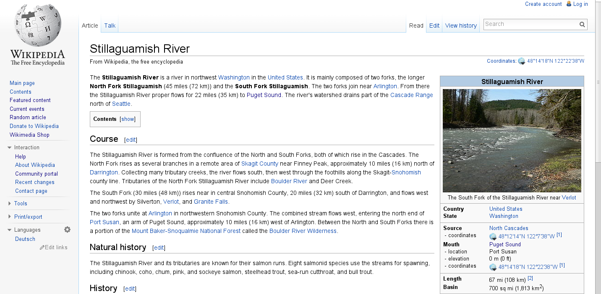

Project Ruby on Rails  Wiki
===========================

Identify Vision
---------------

It is most important to clearly define what your vision   
is for doing this. It is possible for this to change during   
the process of iterating through all the other initial planning steps.   
However without a clear vision of what you are attempting to accomplish,   
identifying the means necessary to get you there, attempting something   
using the wrong tools, and being unrealistic in regard to  
goals you will flounder and end up heading off in the wrong direction.   

__My reflections on the vision of this project considered the following:__  

* If the intent is to create a Wiki in the most efficient means possible,
    the best solution is to:
    
    * Use gollum gem

    * Use mediawiki

__There are disadvantages to both of the above.__  

* Flat file model fails when the scale is large

* Mediawiki is written in php. Is RoR community going to embrace that?

Vision
------

The vision of this project is to build a Ruby on Rails wiki written in Ruby.  
As a wiki, the content will be generated by the Ruby on Rails community  
so that the Ruby on Rails community will have an excellent resource.  

Core Concepts
-------------

The idea is not to reinvent the wheel. The core ideas of wikipedia will
be the precepts of this project. 

Here is a link to pros and cons of a wiki [Wiki Attributes](http://www.mediawiki.org/wiki/Manual:Deciding_whether_to_use_a_wiki_as_your_website_type "Wiki Pros and Cons")

### Design

__Visual impact is very significant:__   

* Attracts Attention

    * Visual appeal gets people interested in a site

    * People prefer beauty over neutral or bad design

* Creates a first impression  

    * Affects whether or not people will want to come back

    * Changing a first impression can be difficult  

* Build relationships  

    * Visual appeal builds relationships  

    * If users can identify with site, you can develop long term relationships  

* Increase tolerance  

    * Visual impact is a quality  

    * Possessing this quality can lessen impact of aspects of site that need help  

* Emotional Impact  

    * A strong visual site grabs the emotions  

    * This can convey to trust, hope, self-confidence.  

__Design should not create negative affects:__

* Ease of use

* Core display of knowledge

* Search capabilities

__Example of Good Design, Wrong App:__

* The below image is an example of something   
    we do not want to use, it is from a bygone   
    day when this type of image was common  
    in the local mechanics garage calendar,   
    and is very sexist. We want to encourage  
    women being in this world,   
    not discourage:

__Example of Good Design:__

* I believe the below is excellent design in
    terms of good layout, navigation, and eye appeal

* The graphic colors have an overall warm balance

* The pastel technique with crisp accent lines gives  
    a sense of focus without being overbearing  

    * This style has proved itself over centuries in   
        impressionist art and chinese/japanese paintings.  
        It is soothing to the soul.   

    * If it is not possible to find a good artist to   
        provide "Ruby on Rails" based pastel artwork,  
        an alternative would be to use this  block for  
        a slow slide-show of events scheduled for next   
        30 days, e.g. meetups, conferences, workshops.  

* The block of artwork on left with text of main subject  
    matter to right is not common, yet seems familiar and  
    friendly.  

* The sub-headers in block layout, with a list of their links  
    is a visually appealing and easy to navigate layout  

* The design begins to pull in a basic color concept of   
    including a color at 3 different levels. They do totally  
    blow that in a portion of page I did not include. However,  
    we would be more aware and follow this good design practice  
    that has a subliminal affect on the mind.  

* The size, color, and location of the 'Start Course' button  
    really emphasize importance of this CTA.  

__Example of Clean, Appealing Navigation__

* [Ruby Monk](https://rubymonk.com/ "Ruby Monk") source of above references.

* For our use,  we could place above the donate  
    button a tag-cloud  

* The tag cloud has a very applealing visual effect,  
    and actually helps us zero in on more popular searches.  

###Wikipedia Foundations
* Internationalization and localisation

* Markup

    * Wikipedia uses its own custom markup,  
        it may work to use it, otherwise Markdown  
        may be a good choice  
* Rich content is supported

* Editing Interface

    * Mediawiki has been coined 'challenging' to use

    * There are some inherent problems using an embedded  
        editor such as CEditor, although variants are available  

* Search

* Tracking Edits

* Navigation

* Page tabs and associated pages

* Category Tags

* Sub-Pages

* Templates

* Groups and Restriction of access

* Footnotes 

* Parser Functions

* Documented Magic Words
    * [Magic Words](http://en.wikipedia.org/wiki/Help:Magic_words "Magic Words") 

###Typical Wiki Page

* Your basic wiki page, idea is to improve the visual impact of this.

* Functionality of basic nav, login at top is still needed,   
    but can't this be designed in a much better way?  

###Tools

Following are recommended tools:

####Search

* sunspot_rails gem

* sunspot_solr gem (pre-packaged dev version)

####General
* acts-as-taggable-on gem

####Database

* Postgresql

####Security

* Devise gem

* Pundit gem

* Oauth gem 

####Images

* Paperclip gem

####Image Storage

* S3

###Deployment

* Other than a toy application, the price incurred for    
    this is just not cost effective on Heroku   

* Providers:  
    * Linode

    * Digital Ocean

* Server
    * Nginx as reverse proxy

    * Unicorn

* Make life easier

    * Chef

###Design Framework

* Foundation

Making it Happen
----------------

* The seed content of good articles will need to be created

    * Do it yourself, and enlist others.

* Identify your categories, articles, events calendar, speakers, conferences

* Create the stubs for the categories

* Create a style guide
    
    * Make sure this requires graphics to keep up visual appeal

* Create Templates

* Be good Code Fellows branding agents

    * Talk to everyone at meetups about this

    * Blog about this

    * Post on your linked in

    * Tweet

    * Create press releases

    * Set up forum so contributers can discuss rules and style

    * Set up an IRC channel

Make it Fun!
============

...and remember the African proverb:      

"If you wish to go fast, go alone. If you wish to go far go with friends."

